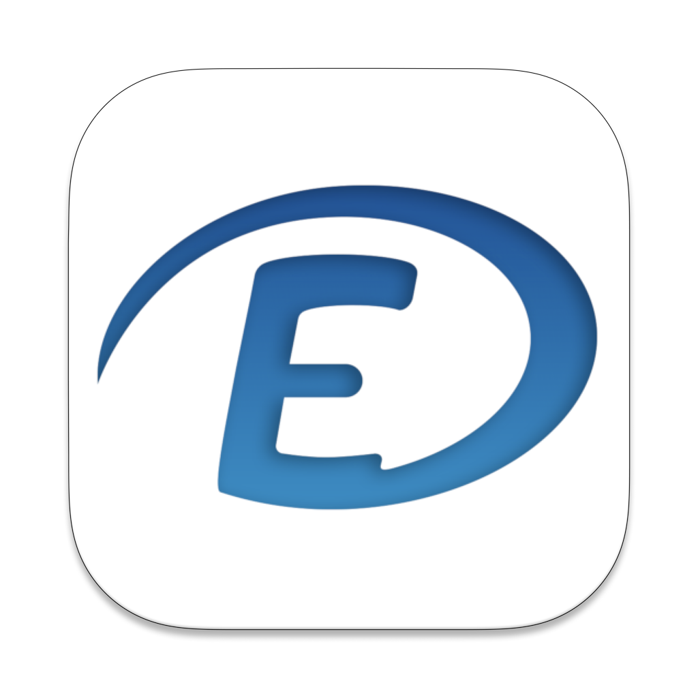

<!-- Improved compatibility of back to top link: See: https://github.com/othneildrew/Best-README-Template/pull/73 -->
<a name="readme-top"></a>
<!--
*** Thanks for checking out the Best-README-Template. If you have a suggestion
*** that would make this better, please fork the repo and create a pull request
*** or simply open an issue with the tag "enhancement".
*** Don't forget to give the project a star!
*** Thanks again! Now go create something AMAZING! :D
-->


<!-- PROJECT SHIELDS -->
<!--
*** I'm using markdown "reference style" links for readability.
*** Reference links are enclosed in brackets [ ] instead of parentheses ( ).
*** See the bottom of this document for the declaration of the reference variables
*** for contributors-url, forks-url, etc. This is an optional, concise syntax you may use.
*** https://www.markdownguide.org/basic-syntax/#reference-style-links
-->
[![Contributors][contributors-shield]][contributors-url]
[![Forks][forks-shield]][forks-url]
[![Stargazers][stars-shield]][stars-url]
[![Issues][issues-shield]][issues-url]
[![MIT License][license-shield]][license-url]


<!-- PROJECT LOGO -->
<br />
<div align="center">
  <a href="https://github.com/StudySuite/AltDirecte">
    
  </a>

  <h3 align="center">AltDirecte</h3>

  <p align="center">
    Repensé de zéro, AltDirecte offre une nouvelle expérience scolaire basée sur EcoleDirecte
    <br />
    <br />
    <a href="https://github.com/StudySuite/AltDirecte/issues">Signaler Bug</a>
    ·
    <a href="https://github.com/StudySuite/AltDirecte/issues">Une idée ?</a>
  </p>
</div>


<!-- TABLE OF CONTENTS -->
<details>
  <summary>Sommaire</summary>
  <ol>
    <li>
      <a href="#a-propos-de-altdirecte">A propos de AltDirecte</a>
      <ul>
        <li><a href="#technologies">Technologies</a></li>
      </ul>
    </li>
    <li><a href="#roadmap">Roadmap</a></li>
    <li><a href="#license">License</a></li>
    <li><a href="#remerciments">Remerciments</a></li>
  </ol>
</details>


<!-- ABOUT THE PROJECT -->
## A propos de AltDirecte

[![AltDirecte - Page d'acceuil][product-screenshot]](https://studysuite.fr)

Redécouvrez EcoleDirecte dans une interface plus belle, plus pratique avec des fonctionnalités inédites. Des notifications supplémentaires pour ne pas manquer une nouvelle note, un rappel des devoirs, des changements de cours et bien plus

Pourquoi utiliser AltDirecte ?
* Plus simple d'utilisation
* Des données reliées entre elles pour un meilleur suivi de vos notes
* Des fonctionnalités inédites
* Compatibilité future avec RéuSuite (nécessite un compte StudySuite)
* Et une interface plus belle et intuitive

AltDirecte n'a pas pour but de remplacer EcoleDirecte mais de l'améliorer pour proposer des fonctionnalités exclusives pour un meilleur suivi.

<p align="right">(<a href="#readme-top">Retour en haut</a>)</p>


### Technologies

Pour créer AltDirecte nous avons utilisé ces librairies et frameworks :


Ce projet sera composé de 2 branches : 
* [Main](https://github.com/StudySuite/AltDirecte/tree/main)
  * La branche ```main``` qui contiendra le code de l'application en version stable, testé et 100% fonctionnelle.
* [Dev](https://github.com/StudySuite/AltDirecte/tree/dev)
  *  La branche ```dev``` qui contiendra le code de l'application en version de test/développement, non testé, surement avec des bugs, mais avec les nouvelles fonctionnalités

<p align="right">(<a href="#readme-top">Retour en haut</a>)</p>


<!-- ROADMAP -->
## Roadmap

- [x] Connexion
  - [x] Double Authentification
- [x] Page d’acceuil
- [x] Notes
- [x] Emploi du temps
- [ ] Vie Scolaire
- [ ] Devoirs
- [ ] Manuels
- [ ] Carnet de correspondances 
- [ ] Documents
- [ ] Espaces de travail
- [ ] Multi-comptes
- [ ] Comptes Parents
- [ ] Features exclusives
  - [ ] Fonctionnement "Hors ligne" (ajout de devoirs non inscrit par des profs et +)
  - [ ] Notifications
  - [ ] Sauvegarde de ses notes
  - [ ] Export et syncronisation vers RéuSuite (nécessite un compte StudySuite)

Regardez les [Issues Ouvertes](https://github.com/StudySuite/AltDirecte/issues) Pour voir toutes les demandes de fonctionnalités (ou les bugs trouvés)

<p align="right">(<a href="#readme-top">Retour en haut</a>)</p>


<!-- LICENSE -->
## License

Distribué sous licence MIT. Voir `LICENSE.txt` pour plus d'informations.

<p align="right">(<a href="#readme-top">Retour en haut</a>)</p>


<!-- ACKNOWLEDGMENTS -->
## Remerciments

Nous remercions ces repos/personnes pour l'aide qu'ils ont apporté au projet (notamment côté API)

* [EcoleDirecte API Docs - EduWireApps](https://github.com/EduWireApps/ecoledirecte-api-docs)
* [yNotes - EduWireApps](https://github.com/EduWireApps/ynotes)
* [MaitreRouge](https://github.com/MaitreRouge/)
* [AltDirecte "Legacy" (macOS) - RetroAndDev](https://github.com/RetroAndDev/AltDirecte/)

<p align="right">(<a href="#readme-top">Retour en haut</a>)</p>


<!-- MARKDOWN LINKS & IMAGES -->
<!-- https://www.markdownguide.org/basic-syntax/#reference-style-links -->

[contributors-shield]: https://img.shields.io/github/contributors/StudySuite/AltDirecte.svg?style=for-the-badge
[contributors-url]: https://github.com/StudySuite/AltDirecte/graphs/contributors
[forks-shield]: https://img.shields.io/github/forks/StudySuite/AltDirecte.svg?style=for-the-badge
[forks-url]: https://github.com/StudySuite/AltDirecte/network/members
[stars-shield]: https://img.shields.io/github/stars/StudySuite/AltDirecte.svg?style=for-the-badge
[stars-url]: https://github.com/StudySuite/AltDirecte/stargazers
[issues-shield]: https://img.shields.io/github/issues/StudySuite/AltDirecte.svg?style=for-the-badge
[issues-url]: https://github.com/StudySuite/AltDirecte/issues
[license-shield]: https://img.shields.io/github/license/StudySuite/AltDirecte.svg?style=for-the-badge
[license-url]: https://github.com/StudySuite/AltDirecte/blob/master/LICENSE.txt
[product-screenshot]: images/screenshot.png
